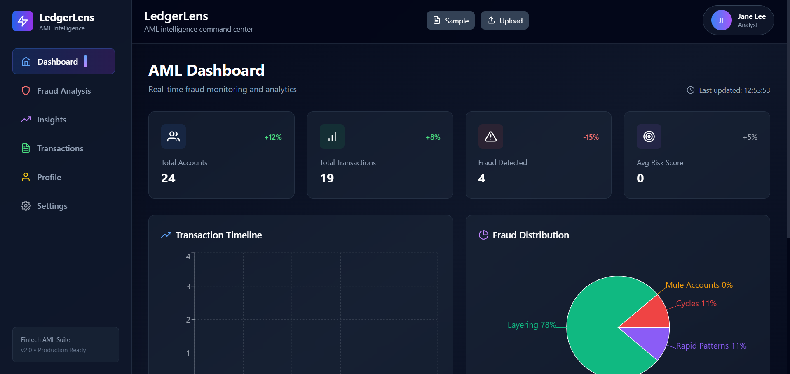
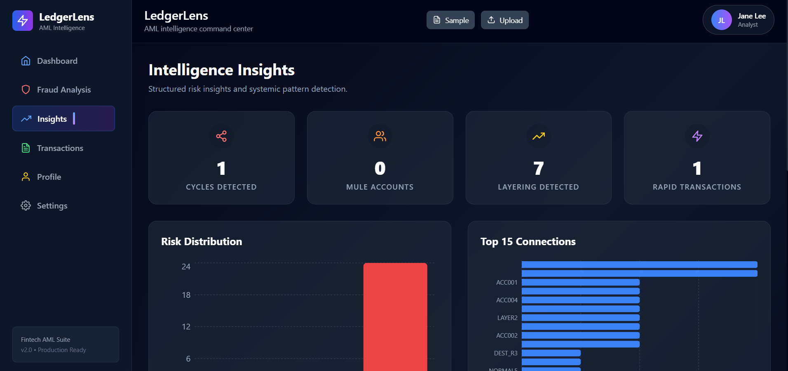
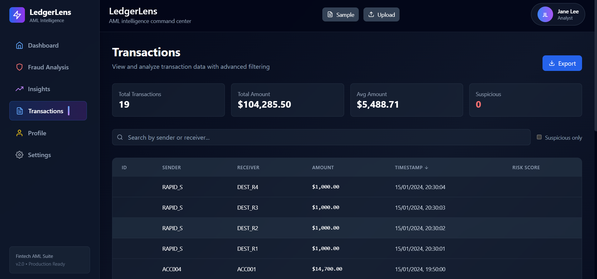
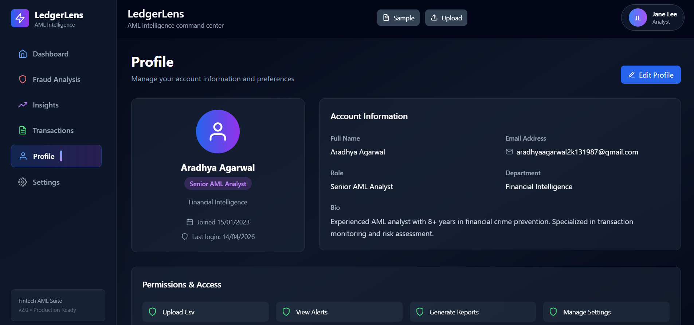

# 💰 LedgerLens – AI AML Intelligence Platform

LedgerLens is a full-stack Anti Money Laundering (AML) intelligence platform that analyzes financial transactions to detect suspicious activities such as layering, rapid transfers, circular transactions, and other fraud patterns using AI-powered analytics.

The platform provides an interactive dashboard, fraud insights, transaction monitoring, and intelligent risk visualization for financial institutions.

---

# ✨ Features

- 📊 AML Dashboard
- 🚨 Fraud Detection Engine
- 📈 Transaction Analytics
- 🔍 Risk Score Analysis
- 📉 Fraud Distribution Charts
- 👥 User Profile & Permissions
- 📂 CSV Transaction Upload
- ⚡ Real-time Dashboard Updates
- 📱 Responsive UI
- 🔒 Secure Backend APIs

---

# 📸 Screenshots

## Dashboard



---

## Intelligence Insights



---

## Transactions



---

## User Profile



---

# 🛠 Tech Stack

## Frontend

- React.js
- Vite
- Tailwind CSS
- Recharts

## Backend

- Python
- FastAPI

## AI / Analytics

- Pandas
- NumPy
- Financial Transaction Analysis
- AML Rule Engine

---

# 📂 Project Structure

```
LEDGERLENS_AML_INTELLIGENCE
│
├── client
│   ├── src
│   ├── public
│   └── package.json
│
├── server
│   ├── routes
│   ├── services
│   ├── utils
│   ├── uploads
│   ├── main.py
│   └── requirements.txt
│
├── screenshots
│   ├── dashboard.png
│   ├── insights.png
│   ├── transactions.png
│   └── profile.png
│
└── README.md
```

---

# 🚀 Installation

Clone repository

```bash
git clone https://github.com/ARADHYA200/LEDGERLENS_AML_INTELLIGENCE.git
```

Backend

```bash
cd server

pip install -r requirements.txt

uvicorn main:app --reload
```

Frontend

```bash
cd client

npm install

npm run dev
```

---

# 📊 Dashboard Modules

- AML Dashboard
- Fraud Detection
- Transaction Timeline
- Fraud Distribution
- Intelligence Insights
- Risk Analytics
- User Management
- CSV Upload
- Financial Reports

---

# 🔮 Future Improvements

- Live Banking API Integration
- AI Risk Prediction Model
- Graph-based Fraud Network Detection
- Multi-user Authentication
- Report Export (PDF & Excel)
- Real-time Transaction Streaming

---

# 👨‍💻 Author

**Aradhya Agarwal**

GitHub:
https://github.com/ARADHYA200

---

## ⭐ If you like this project, consider giving it a Star!